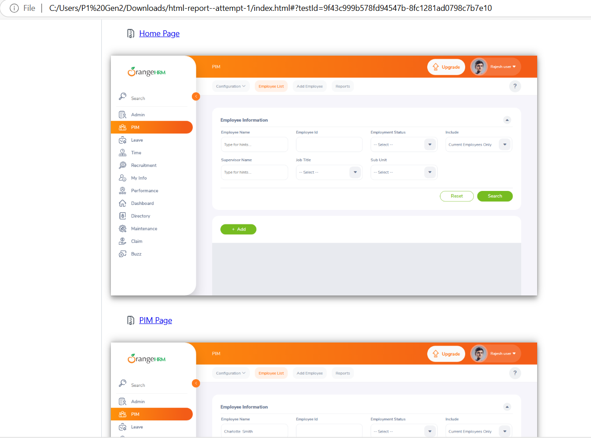

# Framework and Structure
This automation test project is used for testing UI, Regression, API, and performance cases.
The application under test is : https://opensource-demo.orangehrmlive.com/
The project uses Playwright with Node.js to run. Typescript is used as a scripting language.

The tests are grouped as below:
- UI tests are placed in `e2e-tests` folder
- API tests are placed in `api-tests` folder
- Performance tests are placed in `performance-tests` folder (By performance testing, it means we try to capture the performance metrics from chrome browser to assert navigation duration of each entry. It's different with performance testing for backend services to check the scalability of the app under heavy workload.)
- Regression tests are placed in `e2e-tests` folder and are executed using `regression` tag

The environment variables are placed in `env` dir

The UI locators / methods are placed in `pages/management` which follows Page Object Model pattern.

# To run the tests in your local environment:
- npm i
- npm run test:ui # for running ui tests
- npm run test:regression # for running regression tests
- npm run test:api # for running api tests
- npm run test:performance # for running performance test 

# CI/CD pipelines
- The tests are also triggered in GitHub pipelines each time the code is pushed to main branch
- For scheduled tests, tests are also triggered every Sunday at midnight UTC

After the tests have been executed in pipeline, you can check out the html report by downloading the report.
https://github.com/cuongld2/orangehrm/actions/runs/14829157735/job/41627113835

# Test case
Refer to the google sheet link for the test case descriptions for login and search features: https://docs.google.com/spreadsheets/d/1akBfEqA7E3QjN_w9zub0OLtpypNeZMCfzQWPDrJMxoY/edit?gid=0#gid=0